# Examen AWS - Despliegue Web en EC2 con VPC

Manual de configuración de una instancia, de redes y subredesen AWS

**Nombre:** Álvaro Morcillo Pérez  
**Curso:** 1º DAW 

## Primeros pasos antes de la creacion de VPC e Instancias

- Primero deberemos iniciar el laboratorio de AWS. Para ello pulsamos en el botón de arriba a la derecha donde dice "Start Lab".

- Una vez le hallamos dado click a "Start Lab", AWS con el circulo rojo se pondrá en verde lo que nos permitirá entrar a la pantalla de inicio de la consola de AWS donde encontraremos las aplicaciones para poder crear Instancias, redes, subredes y demás.

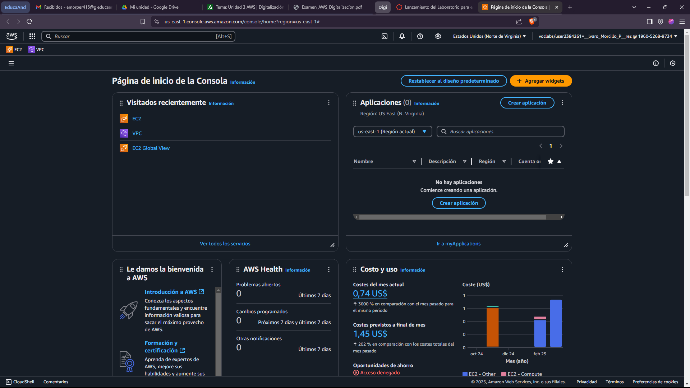

## 1. Configuración de VPC y Subredes

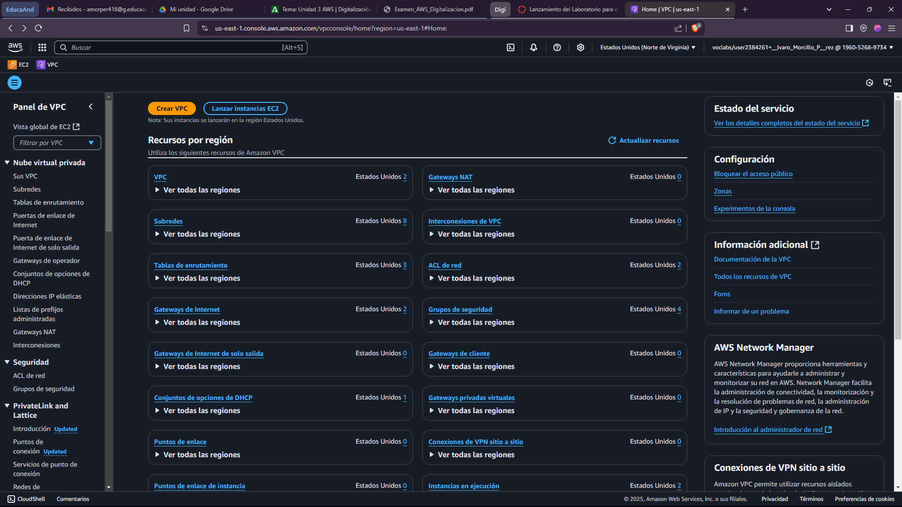

### Paso 1: Crear la VPC

1. En AWS Console, navega a **Services > VPC**.
2. **Create VPC** con los siguientes parámetros:
   - **Nombre de la VPC** `ml-vpc-TuNombre-Apellidos`
   - **IPv4 CIDR block:** `10.0.0.0/16`

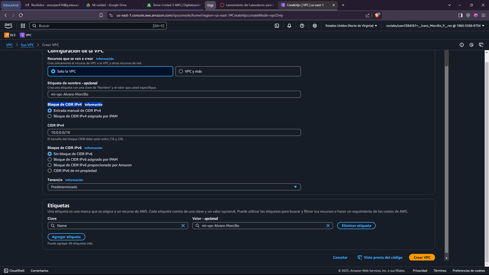

3. Una vez puestos los parámetros requeridos seleccionamos **Crear VPC** y nos saldrá un mensaje de creación exitosa de la VPC.

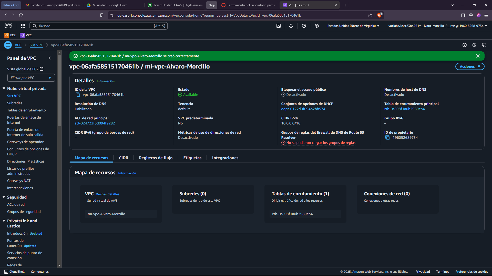

### Paso 2: Crear Subredes

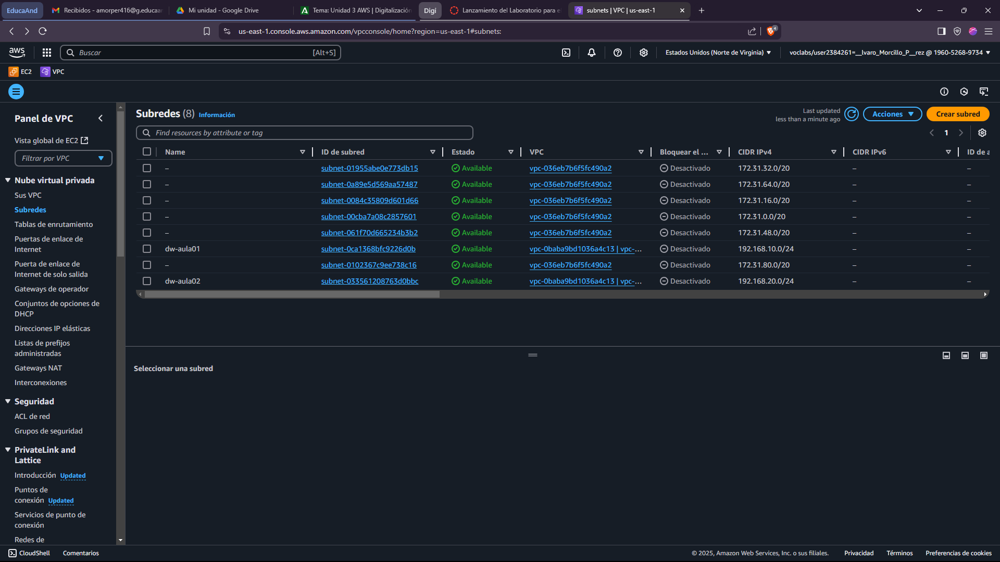

En el panel izquierdo, ve a Subnets > Create subnet.

- **Subred para Linux (Subnet Linux):**
  - **VPC ID:** `Selecciona la VPC creada (mi-vpc-alvaro-morcillo).`
  - **Nombre de subred:** `subnet-linux`
  - **Availability Zone:** `us-east-1a`
  - **CIDR:** `10.0.1.0/24`
  - **Haz clic en Create subnet.**
  
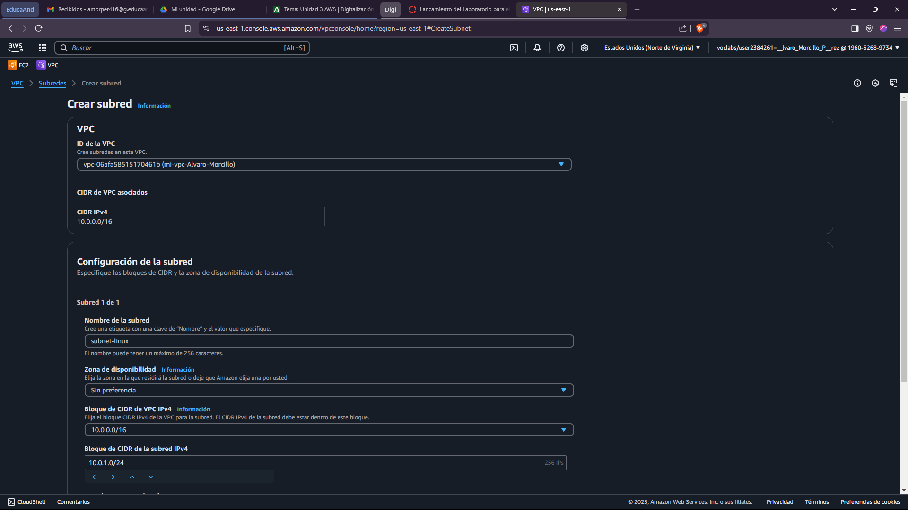

Los pasos a seguir para la creación de la **Subnet-windows** son los mismos, aunque teniendo en cuenta que el **Bloque de CIDR** cambia.

- **Subnet Windows:**
  - **VPC ID:** `Selecciona la VPC creada (mi-vpc-alvaro-morcillo).`
  - **Name:** `subnet-windows`
  - **IPV4 CIDR block:** `10.0.2.0/24`
  - **Availability Zone:** `us-east-1b`
  - **CIDR:** `10.0.2.0/24`
  - **Haz clic en Create subnet.**

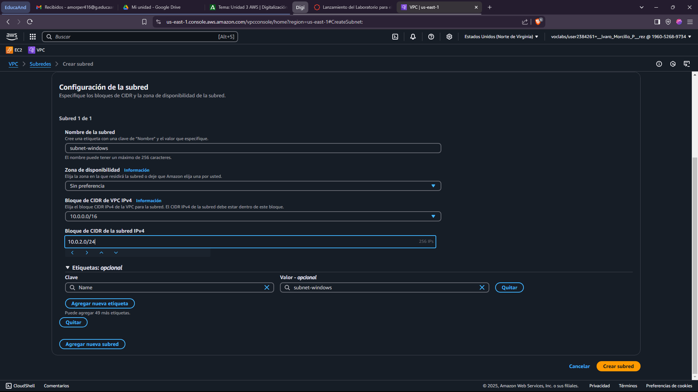

 ### Paso3: Configurar Internet Gateway y tabla de rutas

1. Crea un **Internet Gateway** y asícialo a la VPC.

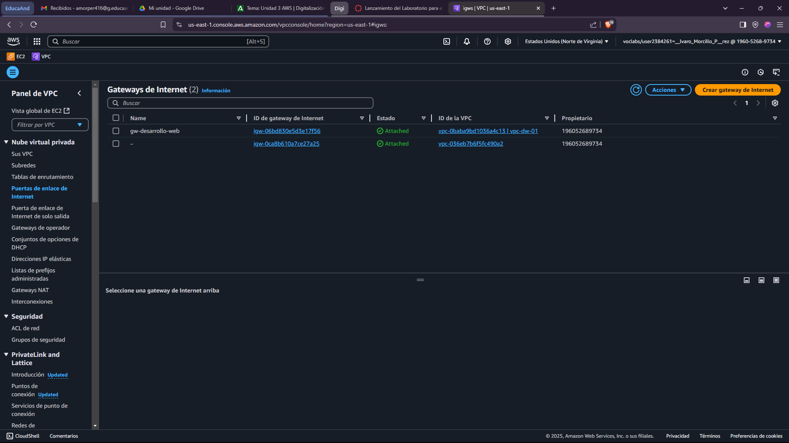

En el panel izquierdo, ve a **Internet Gateways > Create internet gateway**.

- **Nombre del GateWay:** `gateway-examen`
- **Haz clic en Crear**

Una vez creado el Gateway de Internet saldrá un mensaje en verde donde nos saldrá la opción de asociar el GW recien creado a una VPC

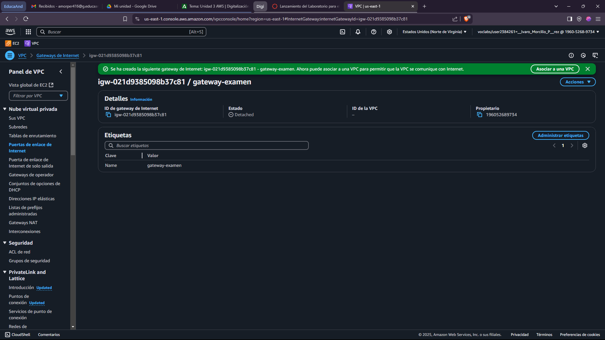

Eligimos nuestra VPC `mi-vpc-alvaro-morcillo` y seleccionamos **Conectar**.

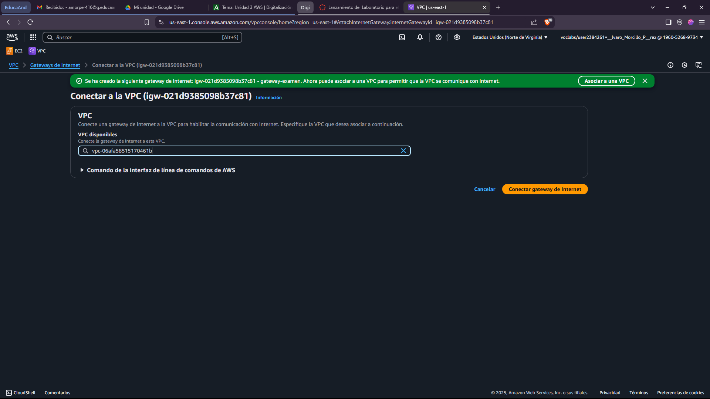

2. Edita la tabla de rutas para añadir `0.0.0.0/0` → Internet Gateway.

   - En el panel izquierdo, ve a **Route Tables** y selecciona la tabla asociada a tu VPC **(ver la columna VPC)**.
   - En la pestaña Routes, haz clic en **Edit routes**.

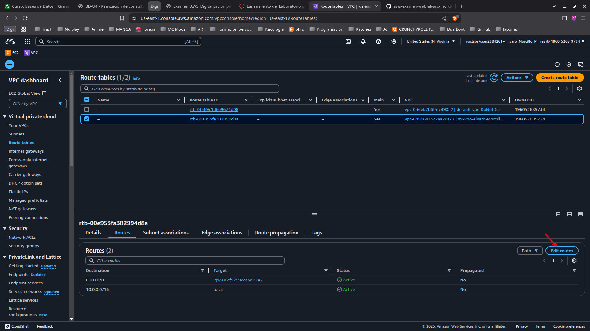

- Seleccionar `Agregar ruta`
- Destination: 0.0.0.0/0.
- Target: Selecciona el Internet Gateway creado `Gateway-examen`.
- Haz clic en Save changes.

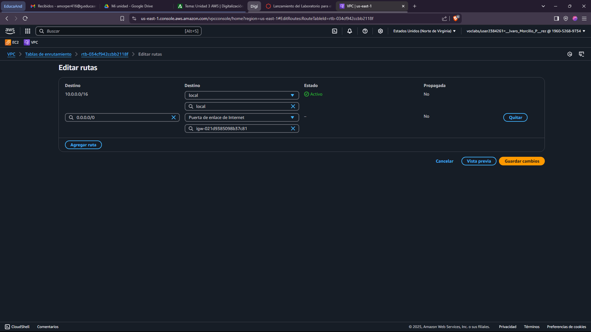

