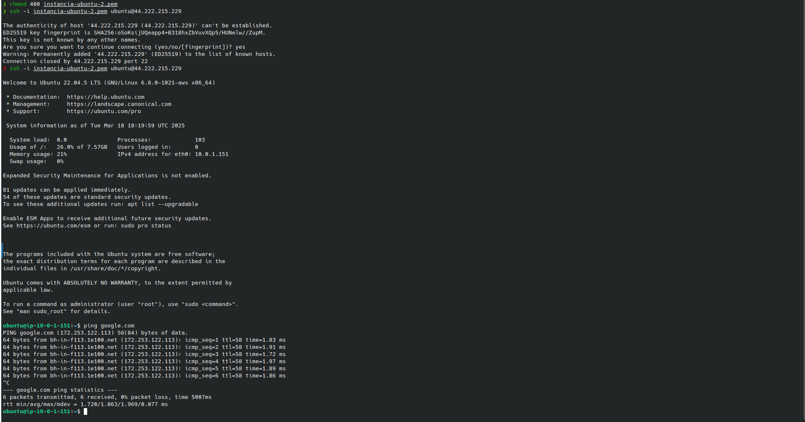
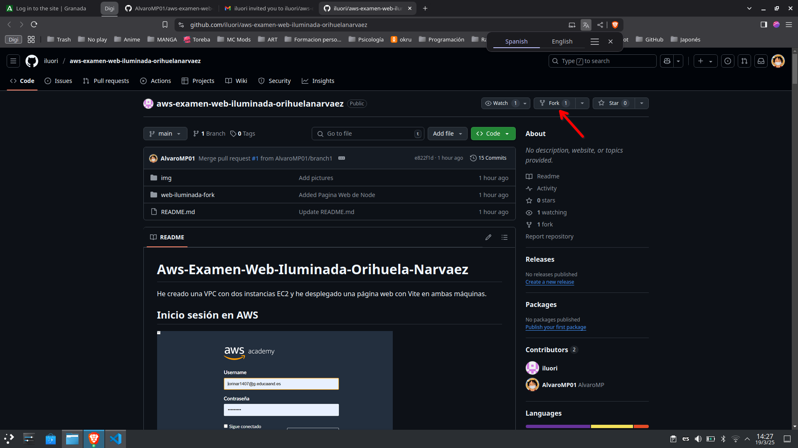

# Examen AWS - Despliegue Web en EC2 con VPC

Manual de configuración de una instancia, de redes y subredesen AWS

**Nombre:** Álvaro Morcillo Pérez  
**Curso:** 1º DAW 

## Primeros pasos antes de la creacion de VPC e Instancias

- Primero deberemos iniciar el laboratorio de AWS. Para ello pulsamos en el botón de arriba a la derecha donde dice "Start Lab".

- Una vez le hallamos dado click a "Start Lab", AWS con el circulo rojo se pondrá en verde lo que nos permitirá entrar a la pantalla de inicio de la consola de AWS donde encontraremos las aplicaciones para poder crear Instancias, redes, subredes y demás.


## 1. Configuración de VPC y Subredes


### Paso 1: Crear la VPC

1. En AWS Console, navega a **Services > VPC**.
2. **Create VPC** con los siguientes parámetros:
   - **Nombre de la VPC** `ml-vpc-TuNombre-Apellidos`
   - **IPv4 CIDR block:** `10.0.0.0/16`


3. Una vez puestos los parámetros requeridos seleccionamos **Crear VPC** y nos saldrá un mensaje de creación exitosa de la VPC.


### Paso 2: Crear Subredes

En el panel izquierdo, ve a **Subnets > Create subnet**


- **Subred para Linux (Subnet Linux):**
  - **VPC ID:** `Selecciona la VPC creada (mi-vpc-alvaro-morcillo).`
  - **Nombre de subred:** `subnet-linux`
  - **Availability Zone:** `us-east-1a`
  - **CIDR:** `10.0.1.0/24`
  - **Haz clic en Create subnet.**
  


Los pasos a seguir para la creación de la **Subnet-windows** son los mismos, aunque teniendo en cuenta que el **Bloque de CIDR** cambia.

- **Subnet Windows:**
  - **VPC ID:** `Selecciona la VPC creada (mi-vpc-alvaro-morcillo).`
  - **Name:** `subnet-windows`
  - **IPV4 CIDR block:** `10.0.2.0/24`
  - **Availability Zone:** `us-east-1b`
  - **CIDR:** `10.0.2.0/24`
  - **Haz clic en Create subnet.**


 ### Paso3: Configurar Internet Gateway y tabla de rutas

1. Crea un **Internet Gateway** y asícialo a la VPC.


En el panel izquierdo, ve a **Internet Gateways > Create internet gateway**.

- **Nombre del GateWay:** `gateway-examen`
- **Haz clic en Crear**

Una vez creado el Gateway de Internet saldrá un mensaje en verde donde nos saldrá la opción de asociar el GW recien creado a una VPC


Eligimos nuestra VPC `mi-vpc-alvaro-morcillo` y seleccionamos **Conectar**.


2. Edita la tabla de rutas para añadir `0.0.0.0/0` → Internet Gateway.

   - En el panel izquierdo, ve a **Route Tables** y selecciona la tabla asociada a tu VPC **(ver la columna VPC)**.
   - En la pestaña Routes, haz clic en **Edit routes**.


- Seleccionar `Agregar ruta`
- Destination: 0.0.0.0/0.
- Target: Selecciona el Internet Gateway creado `Gateway-examen`.
- Haz clic en **Guardar Cambios**.


## 2. Creación de Instancias EC2

Ve a **Servicios > EC2 > Lanzar la Instancia**


### Instancia Windows Server 2022
- **Nombre:** `windows-server`
- **AMI:** Windows Server 2022
- **Tipo:** `t3.medium`
- **Subnet:** `subnet-windows`
- **Nombre del Security Group:** `SG-Windows`
- **Security Group Entrante:** `RDP (3389)`, `HTTP (80)`, `Vite (5173)`.


- **Asignar automaticamente la IP Publica:** `Habilitar`.


- **Para añadir el protocolo para el puerto de Vite añadimos un **Custom TCP** y escribimos el puerto manualmente `5173`.**


### Instancia Ubuntu 22.04
- **Nombre:** `ubuntu-server`
- **AMI:** Ubuntu 22.04 LTS
- **Tipo:** `t2.micro`
- **Subnet:** `subnet-linux`
- **Security Group:** `SG-Ubuntu` 
- **Security Group Entrante:**`SSH (22)`, `HTTP (80)`. `Vite (5173)`.


- **Asignar automaticamente la IP Publica:** `Habilitar`.


- **Para añadir el protocolo para el puerto de Vite añadimos un **Custom TCP** y escribimos el puerto manualmente `5173`.**


## 3. Instalación de Software y Despliegue Web

### configuración en Linux

```bash
# Instalar Node.js y npm
sudo apt update && sudo apt install nodejs npm -y
# Instalar Vite y Serve
sudo npm install -g vite serve
```


```bash
# Crear proyecto y desplegar
mkdir web-alvaro-morcillo && cd web-alvaro-morcillo
npm init vite@latest .
npm install
npm run build
serve -s dist -l 5173
```


## 4. Conexión a la instancias

### En Linux

- En la terminal

```bash
chmod 400 clave.pem
ssh -i instancia-ubuntu.pem ubuntu@44.222.215.229
```
Para comprobar que exista una conexión de la instancia con internet podemos ejecutar
```bash 
ping google.com
```




### Comprobar la conexión en el navegador

http://localhost:5173


# Colaboración mediante Pull Request (PR) en GitHub

## Pasos para realizar un Pull Request

### **1. Preparación del repositorio del compañero**

**El compañero debe:**
1. Tener un repositorio en GitHub: `nombre-de-su-repositorio`.
2. Añadir colaborador:
   - Ir a **Settings > Collaborators** y añadir tu usuario de GitHub `AlvaroMP01`.

### **2. Crear un Fork del repositorio**
1. Acceder al repositorio del compañero en GitHub.
2. Clic en **Fork** (esquina arriba a la derecha).  



### **3. Clonar tu Fork localmente**

```bash
git clone https://github.com/tu-usuario/repositorio-compañero-forkeado.git
cd repositorio-compañero-forkeado
```

### **4. Realizar cambios y revisiones**

- Lo cambios realizados en el repositorio del compañero fueron:
  - Creación de un proyecto con Node y Vite


### **5. Hacer commit y subir los cambios**


### **6. Crear el Pull Request**

1. En el repositorio forkeado, hacer clic donde dice `Compare & Pull Request`


2. Se nos abrirá el Pull Request, donde podremos poner un título y descripción de los cmabios que hayamos realizado anteriormente.

     - Una vez hayamos puesto el título y descripción de lo que hemos hecho, daremos clic en `Create Pull Request` (en la esquina abajo a la derecha).


3. Hecho esto habremos completado el Pull Request


- Siempre que los cambios realizados en el repositorio sean revisados por el compañero y esté de acuerdo con ello, podremos hacer un `Merge` a la rama principal de este.

